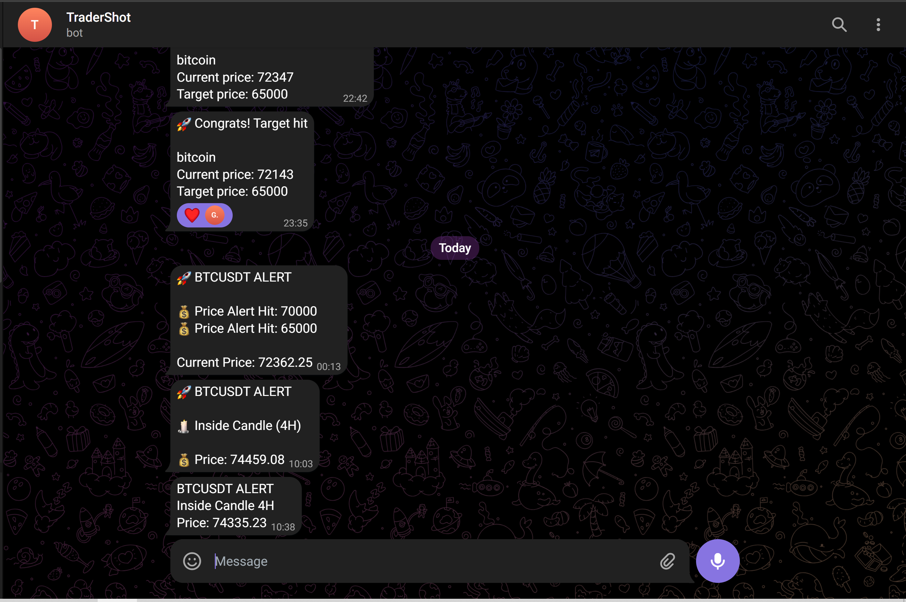

# 🚀 Crypto Trading Alert Bot

A Python-based automated crypto trading alert bot that detects high-probability setups and sends real-time notifications to Telegram.

---

## 🔥 Features

* 🕯 Inside Candle detection (1H & 4H)
* 📊 EMA 50 Support & Resistance alerts
* ⚡ Real-time Telegram notifications
* 🚫 Duplicate alert prevention
* 🔁 Continuous market monitoring (24/7 ready)

---

## 🛠 Tech Stack

* Python
* Binance API
* Pandas
* Telegram Bot API

---

## 📦 Setup Guide

1. Clone the repository:

```bash
git clone https://github.com/Gunshot7538/Crypto-Price-Alert.git
```

2. Navigate to project folder:

```bash
cd Crypto-Price-Alert
```

3. Install dependencies:

```bash
pip install -r requirements.txt
```

4. Create a `.env` file:

```env
BOT_TOKEN=your_bot_token
CHAT_ID=your_chat_id
```

5. Run the bot:

```bash
python bot.py
```

---

## 🎬 Demo

```
🚀 BTCUSDT ALERT

🕯 Inside Candle (4H)
📊 EMA 50 Support Touch (1H)

💰 Price: 74335
```

---

## ⚙️ How It Works

1. Fetches market data from Binance API
2. Calculates EMA (50) using Pandas
3. Detects Inside Candle patterns
4. Sends alerts via Telegram Bot

---

## 🧠 Problem

Traders often miss important setups because monitoring charts continuously is difficult.

## ✅ Solution

This bot automates technical analysis and sends real-time alerts, helping traders take faster and better decisions.

---

## 📸 Live Alert



---

## 🚀 Future Improvements

* Multi-coin scanning
* Breakout detection
* Auto trading (entry, SL, TP)
* Web dashboard

---

## ⚠️ Important Notes

* Do NOT share your `.env` file
* Keep your bot token private
* Bot must be running continuously

---

💡 Built for learning + real trading usage.

⭐ If you like this project, consider giving it a star!
